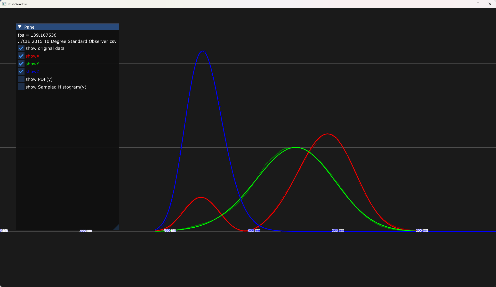
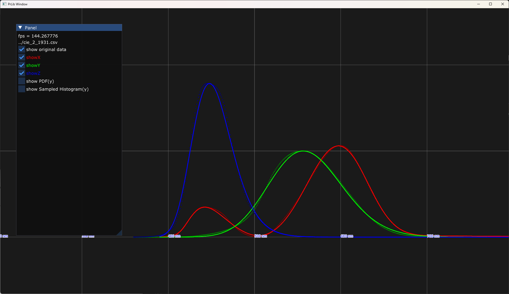

## A simple and table-free analytic approximation of color matching functions

- CIE 1931 2 Degree 
- CIE 2015 10 Degree Standard Observer

Importance sampling based on [Trimmed Logistic](https://pbr-book.org/4ed/Utilities/Mathematical_Infrastructure#TrimmedLogistic) for the simplicity of CDF.

## CIE 2015 10 Degree Standard Observer


```
namespace CIE_2015_10deg
{
    inline float asymmetric_gaussian(float x, float mean, float sigma, float a) {
        float k = (x - mean) / (sigma + a * (x - mean));
        return expf(-k * k);
    }
    inline float cmf_x(float x) {
        float a = 0.42f * asymmetric_gaussian(x, 445.5875549316406f, 31.161394119262695f, 0.065997414290905f);
        float b = 1.16f * asymmetric_gaussian(x, 594.5599975585938f, 48.59465408325195f, -0.04558335989713669f);
        return a + b - a * b * 42.55435562133789f;
    }
    inline float cmf_y(float x) {
        return 1.0f * asymmetric_gaussian(x, 556.8383178710938f, 66.54190826416016f, -0.026492968201637268f);
    }
    inline float cmf_z(float x) {
        return 2.146832f * asymmetric_gaussian(x, 445.9251708984375f, 30.91781997680664f, 0.08379140496253967f);
    }
}

```

<details> <summary>Importance Sampling( cmf_y_pdf( nm ), cmf_y_sample( 0.0 to 1.0 ) )</summary>

```
namespace CIE_2015_10deg
{
    inline float logistic_pdf(float x, float s)
    {
        float k = expf(-fabsf(x) / s);
        return s * k / ((1.0 + k) * (1.0 + k));
    }
    inline float logistic_cdf(float x, float s)
    {
        return 1.0f / (1.0f + expf(-x / s));
    }
    inline float inverse_logistic_cdf(float u, float s)
    {
        if (0.99999994f < u) { u = 0.99999994f; }
        if (u < 1.175494351e-38f) { u = 1.175494351e-38f; }
        return -s * logf(1.0f / u - 1.0f);
    }
    inline float trimmed_logistic_pdf(float x, float s, float a, float b)
    {
        return logistic_pdf(x, s) / (logistic_cdf(b, s) - logistic_cdf(a, s));
    }

    inline float cmf_y_pdf(float x) {
        float sx = x - 554.270751953125f;
        float s = 26.879621505737305f;
        float a = -164.270751953125;
        float b = 275.729248046875;
        return logistic_pdf(sx, 26.879621505737305f) / (logistic_cdf(b, s) - logistic_cdf(a, s));
    }

    inline float cmf_y_sample(float u) {
        float s = 26.879621505737305f;
        float a = -164.270751953125;
        float b = 275.729248046875;
        float Pa = logistic_cdf(a, s);
        float Pb = logistic_cdf(b, s);
        return inverse_logistic_cdf(Pa + (Pb - Pa) * u, s) + 554.270751953125f;
    }
}
```
</details> 

## CIE 1931 2 Degree 


```
namespace CIE_1931_2deg
{
    inline float asymmetric_gaussian(float x, float mean, float sigma, float a) {
        float k = (x - mean) / (sigma + a * (x - mean));
        return expf(-k * k);
    }
    inline float cmf_x(float x) {
        float a = 0.42f * asymmetric_gaussian(x, 447.95562744140625f, 38.40695571899414f, 0.40412160754203796f);
        float b = 1.64f * asymmetric_gaussian(x, 588.0320434570312f, 55.6748046875f, -0.1073513776063919f);
        return a + b - a * b * 8.491180419921875f;
    }
    inline float cmf_y(float x) {
        return 1.0f * asymmetric_gaussian(x, 556.5616455078125f, 59.5950927734375f, 0.056370146572589874f);
    }
    inline float cmf_z(float x) {
        return 1.7829682f * asymmetric_gaussian(x, 447.90704345703125f, 32.452816009521484f, 0.12668778002262115f);
    }
}

```

<details> <summary>Importance Sampling( cmf_y_pdf( nm ), cmf_y_sample( 0.0 to 1.0 ) )</summary>

```
namespace CIE_1931_2deg
{
    inline float logistic_pdf(float x, float s)
    {
        float k = expf(-fabsf(x) / s);
        return s * k / ((1.0 + k) * (1.0 + k));
    }
    inline float logistic_cdf(float x, float s)
    {
        return 1.0f / (1.0f + expf(-x / s));
    }
    inline float inverse_logistic_cdf(float u, float s)
    {
        if (0.99999994f < u) { u = 0.99999994f; }
        if (u < 1.175494351e-38f) { u = 1.175494351e-38f; }
        return -s * logf(1.0f / u - 1.0f);
    }
    inline float trimmed_logistic_pdf(float x, float s, float a, float b)
    {
        return logistic_pdf(x, s) / (logistic_cdf(b, s) - logistic_cdf(a, s));
    }

    inline float cmf_y_pdf(float x) {
        float sx = x - 559.8692016601562f;
        float s = 23.981721878051758f;
        float a = -169.86920166015625;
        float b = 270.13079833984375;
        return logistic_pdf(sx, 23.981721878051758f) / (logistic_cdf(b, s) - logistic_cdf(a, s));
    }

    inline float cmf_y_sample(float u) {
        float s = 23.981721878051758f;
        float a = -169.86920166015625;
        float b = 270.13079833984375;
        float Pa = logistic_cdf(a, s);
        float Pb = logistic_cdf(b, s);
        return inverse_logistic_cdf(Pa + (Pb - Pa) * u, s) + 559.8692016601562f;
    }
}
```

</details>

## Build

```
git submodule update --init
premake5 vs2022
```

## Ref
- [Simple Analytic Approximations to the CIE XYZ Color Matching Functions](https://jcgt.org/published/0002/02/01/)
- [colour-science](https://colour.readthedocs.io/en/v0.4.5/generated/colour.MSDS_CMFS.html)
- [PBRT Trimmed Logistic](https://pbr-book.org/4ed/Utilities/Mathematical_Infrastructure#TrimmedLogistic)

